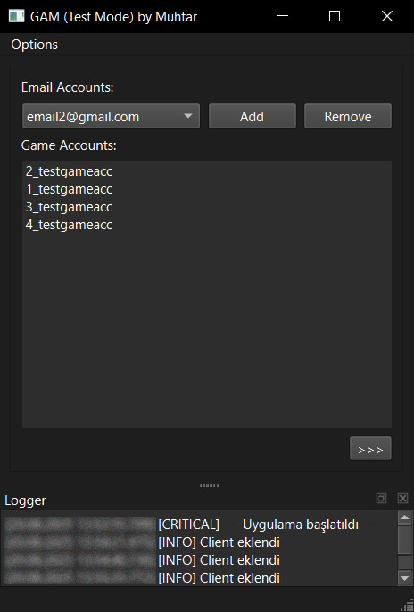
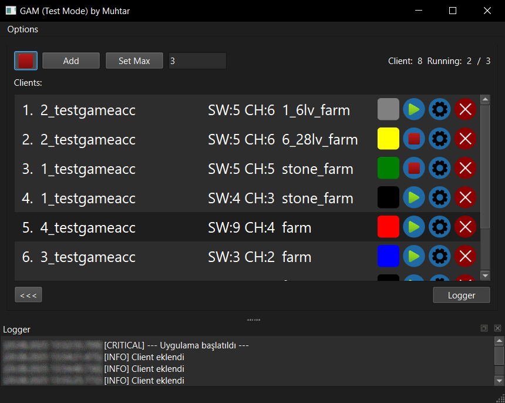

# Game Account Manager: Oyun Hesapları Yönetim Aracı  

## Program Hakkında  
Bu program, oyun hesaplarının tek bir pencerede kolayca yönetilmesini sağlar. Oyun istemcilerini tek tıkla başlatma ve durumlarını takip etme imkanı sunar.  

---

## Özellikler

* **Tek Pencereden Hesap Yönetimi:** Tüm oyun hesaplarını merkezi bir arayüzden yönetir.
* **Oyun İstemcisi Kontrolü:** İstemcileri başlatma ve mevcut durumlarını takip etme.
* **Log Analizi:** Log sistemi sayesinde yapılan işlemleri analiz etme.

- **Durumlar**  
⬛ İstemci kapalı.  
🟨 İstemci açılıyor.  
🟩 İstemci açık.  
🟦 İstemci kapandı. (Otomatik yeniden açılır.)  
🟥 Hata. (Hesap bilgisinin yanlış olması veya istenilmeyen bir durum oluşması.)  
⬜ Bot bitti. (İstenilen görev tamamlandı.)

---

**Not:** Bu depo, yalnızca programın grafiksel arayüzünü (GUI) paylaşmaktadır.

## Arayüz Görüntüleri

### Ana Pencere

### Log Paneli Aktif

### Sol Panel

### Sağ Panel

